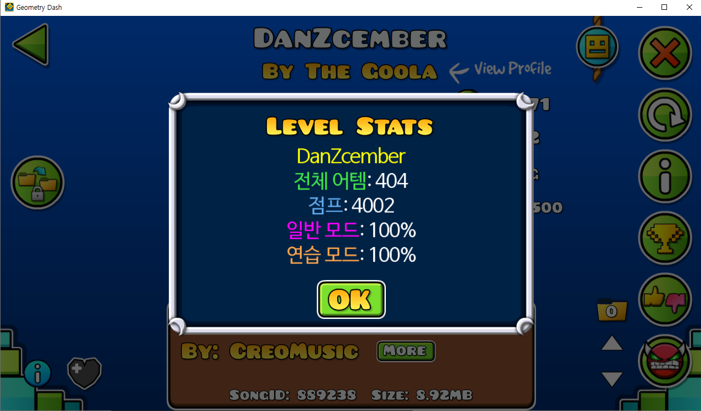

게임 Geometry Dash의 텍스트를 번역해 표시하는 실험적 프로젝트입니다.



# 빌드
1. ```git clone https://github.com/quasar-kim/gmd-language-patch```
2. Visual Studio 2019로 프로젝트를 연 다음 ```x86```으로 빌드합니다.
3. 솔루션 디렉토리의 ```bin```에 빌드된 dll이 생성됩니다.

# 구조
## asset
### fonts
게임 내에서 한글을 띄우기 위해 필요한 비트맵 폰트들입니다.

게임 리소스 폴더 내의 폰트 파일들 덮어쓰기하면 사용할 수 있습니다.


#### 폰트 목록
> 이 페이지에는 우아한형제들에서 제공한 배달의민족 한나체가 포함되어 있습니다.

 - ChatFont
   - 나눔고딕(Graphic: Low)
 - BigFont
   - 배달의 민족 주아(Graphic: Low)


### translation
 - ```recorded-text.json```: 게임을 플레이하면서 추출된 텍스트들입니다. 여러 줄 텍스트는 분리되어서 저장되 있습니다.
 - ```ko-kr.json```: 한글 번역 파일입니다. ```GeometryDash.exe```와 같은 위치에 있어야 적용됩니다.
 - ```extractedText.txt```: ```GeometryDash.exe```에서 추출된 텍스트들입니다. ```recorded-text.json```과 다르게 끊어지지 않은 전체 텍스트를 담고 있습니다.

## include
외부 라이브러리들의 헤더 파일들입니다.

## lib
외부 라이브러리들의 ```.lib```파일들입니다.

## src
메인 코드 디렉토리입니다.

```GeometryDash.exe``` 내부로 inject 될 dll의 프로젝트 폴더입니다. 빌드 후 [Xenos](https://github.com/byronka/xenos)와 같은 dll inject 툴을 이용해 inject하면 적용됩니다.

# To-Do
- [X] ~~*여러 줄 텍스트 지원*~~
- [ ] 번역된 텍스트에 색깔 입히기 지원
- [ ] 포맷 문자열 지원(Ex: ```Total Attempts:%i```);
- [ ] DLL Injection 기능을 갖춘 커스텀 게임 런처

# 라이선스
MIT 라이선스

## 외부 라이브러리
 - [Detours](https://github.com/microsoft/Detours/blob/master/LICENSE.md): MIT License
 - [JSON](https://github.com/nlohmann/json/blob/develop/LICENSE.MIT) (JSON for Modern C++): MIT License
